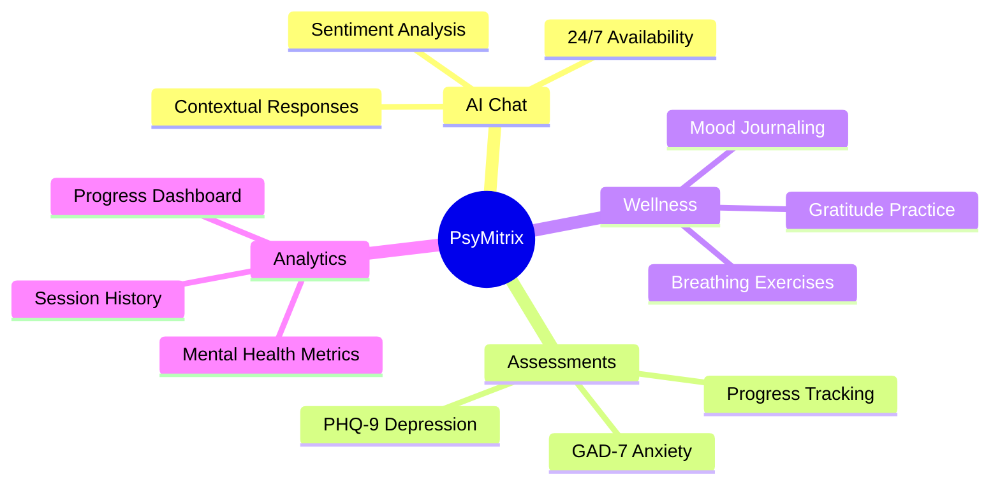
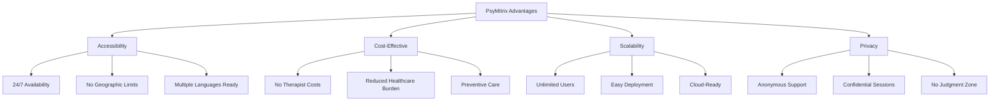
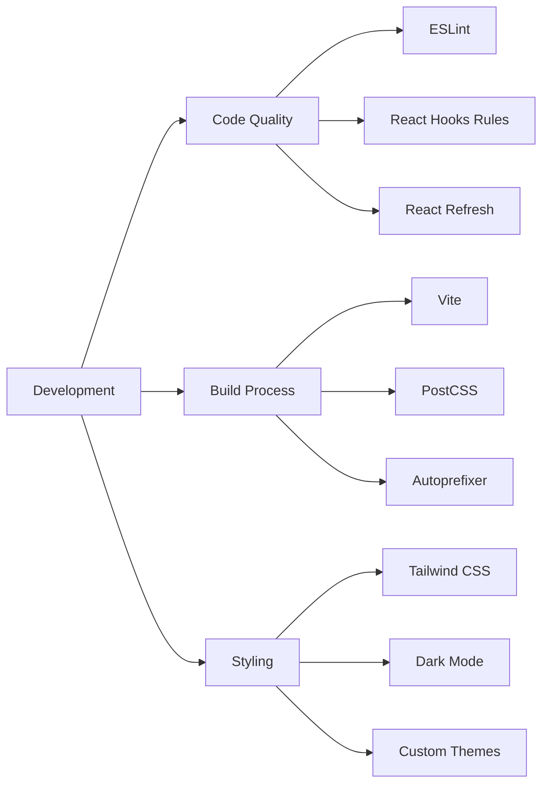
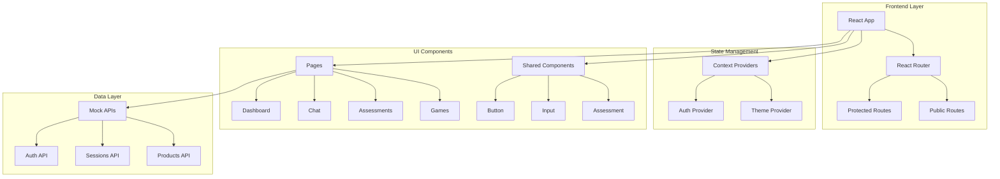
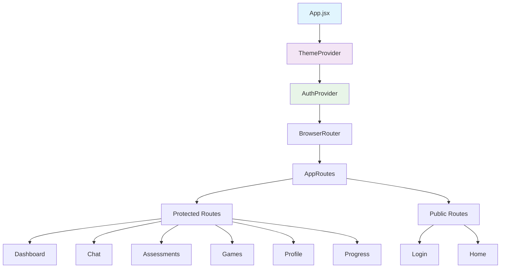
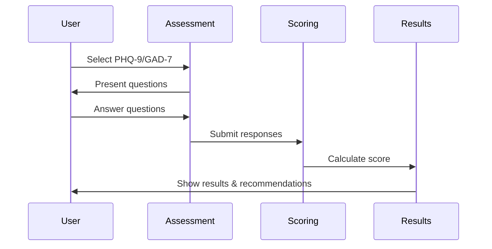
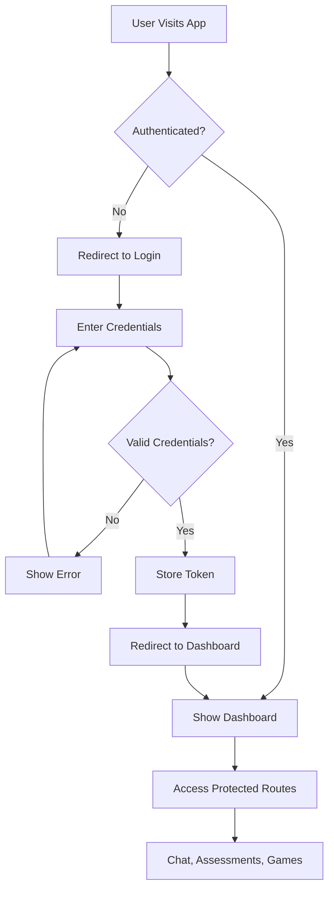
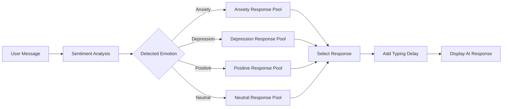
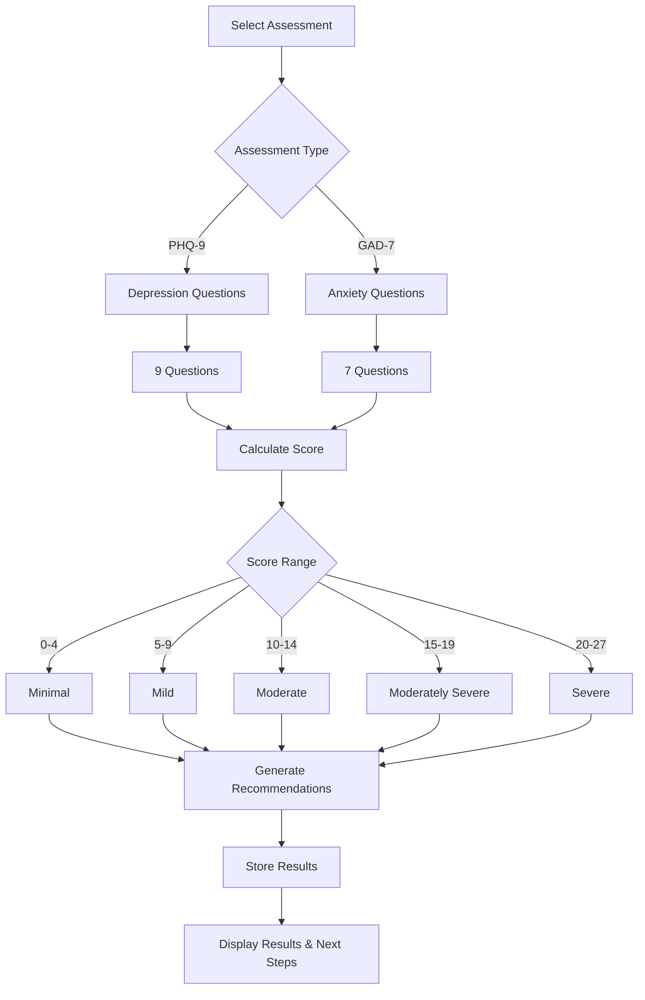

# 🧠 PsyMitrix - AI Mental Health Companion

<div align="center">


[](https://reactjs.org/)
[](https://vitejs.dev/)
[](https://tailwindcss.com/)
[](LICENSE)

*Your personalized AI-powered mental health companion providing support through conversations, assessments, and wellness activities*

[🚀 Live Demo](#-demo) • [📖 Documentation](#-table-of-contents) • [🛠️ Installation](#-installation) • [🤝 Contributing](#-contributing)

</div>

---

## 📋 Table of Contents

- [🌟 About The Project](#-about-the-project)
- [✨ Features](#-features)
- [🏆 Advantages](#-advantages)
- [🛠️ Tech Stack](#️-tech-stack)
- [🏗️ Architecture](#️-architecture)
- [🚀 Installation](#-installation)
- [💻 Usage](#-usage)
- [📁 Project Structure](#-project-structure)
- [🔄 Workflows](#-workflows)
- [🎮 Demo](#-demo)
- [🤝 Contributing](#-contributing)
- [📄 License](#-license)
- [📞 Contact](#-contact)

---

## 🌟 About The Project

**PsyMitrix** is an innovative AI-powered mental health companion designed to provide accessible, personalized mental health support. Built as a comprehensive frontend demonstration, it showcases modern web technologies while addressing the critical need for mental health resources.

### 🎯 Mission
To democratize mental health support through AI-powered conversations, evidence-based assessments, and interactive wellness activities, making mental health care more accessible and less stigmatized.

### 🔍 What Makes PsyMitrix Special



---

## ✨ Features

### ���� Core Features

| Feature | Description | Status |
|---------|-------------|--------|
| 🤖 **AI Psychiatrist Chat** | Interactive conversations with sentiment analysis and contextual responses | ✅ Active |
| 📊 **Mental Health Assessments** | Standardized PHQ-9 and GAD-7 assessments with scoring | ✅ Active |
| 🎮 **Wellness Games** | Interactive breathing exercises, mood tracking, and gratitude practices | ✅ Active |
| 📈 **Progress Dashboard** | Comprehensive analytics and progress tracking | ✅ Active |
| 🔐 **User Authentication** | Secure login/logout with session management | ✅ Active |
| 🌙 **Dark/Light Theme** | Responsive theme switching with persistence | ✅ Active |
| 📱 **Responsive Design** | Optimized for desktop, tablet, and mobile devices | ✅ Active |

### 🎯 Detailed Feature Breakdown

#### 🤖 AI Chat System
- **Sentiment Analysis**: Real-time emotion detection from user messages
- **Contextual Responses**: Tailored responses based on anxiety, depression, or positive sentiment
- **Session Persistence**: Chat history maintained throughout user session
- **Typing Indicators**: Realistic AI typing simulation for enhanced UX

#### 📊 Mental Health Assessments
- **PHQ-9 (Depression)**: 9-question standardized depression screening
- **GAD-7 (Anxiety)**: 7-question generalized anxiety disorder assessment
- **Automated Scoring**: Real-time calculation with severity interpretation
- **Progress Tracking**: Historical assessment results and trend analysis

#### 🎮 Interactive Wellness Games
- **Breathing Exercise**: Guided 4-4-6 breathing pattern with visual cues
- **Mood Journal**: Daily mood tracking with notes and patterns
- **Gratitude Practice**: Structured gratitude exercises for positive psychology

---

## 🏆 Advantages

### 🚀 Technical Advantages

| Advantage | Description | Impact |
|-----------|-------------|--------|
| ⚡ **Lightning Fast** | Vite-powered development with instant HMR | 🔥 High Performance |
| 🎨 **Modern UI/UX** | Tailwind CSS with custom design system | 💎 Professional Look |
| 📱 **Mobile-First** | Responsive design across all devices | 📈 Better Accessibility |
| 🔒 **Type Safety** | JavaScript with prop validation | 🛡️ Fewer Bugs |
| 🌙 **Theme Support** | Built-in dark/light mode switching | 👤 Better UX |
| 🔧 **Modular Architecture** | Component-based structure for scalability | 🏗️ Maintainable Code |

### 💡 Business Advantages



---

## 🛠️ Tech Stack

### Frontend Technologies

| Technology | Version | Purpose | Why Chosen |
|------------|---------|---------|------------|
| ⚛️ **React** | 18.2.0 | UI Framework | Component reusability, Virtual DOM, Large ecosystem |
| ⚡ **Vite** | 5.0.8 | Build Tool | Lightning-fast HMR, optimized builds, ES modules |
| 🎨 **Tailwind CSS** | 3.3.6 | Styling | Utility-first, responsive design, small bundle size |
| 🛣️ **React Router** | 6.8.0 | Navigation | SPA routing, protected routes, clean URLs |
| 🔧 **ESLint** | 8.55.0 | Code Quality | Consistent code style, error prevention |

### Development Tools



---

## 🏗️ Architecture

### System Architecture



### Component Hierarchy



---

## 🚀 Installation

### Prerequisites

Before you begin, ensure you have the following installed:

| Requirement | Version | Download Link |
|-------------|---------|---------------|
| 📦 **Node.js** | ≥ 16.0.0 | [nodejs.org](https://nodejs.org/) |
| 📋 **npm** | ≥ 8.0.0 | Included with Node.js |
| 💻 **Git** | Latest | [git-scm.com](https://git-scm.com/) |

### Quick Start

```bash
# 1️⃣ Clone the repository
git clone https://github.com/your-username/psymitrix.git
cd psymitrix

# 2️⃣ Install dependencies
npm install

# 3️⃣ Start development server
npm run dev

# 4️⃣ Open your browser
# Navigate to http://localhost:5173
```

### Available Scripts

| Command | Description | Usage |
|---------|-------------|-------|
| `npm run dev` | Start development server with HMR | Development |
| `npm run build` | Build for production | Deployment |
| `npm run preview` | Preview production build | Testing |
| `npm run lint` | Run ESLint code analysis | Code Quality |

### Environment Setup

Create a `.env` file in the root directory (optional for demo):

```env
# Development Configuration
VITE_APP_NAME=PsyMitrix
VITE_APP_VERSION=1.0.0

# API Configuration (for future backend integration)
VITE_API_BASE_URL=https://api.psymitrix.com
VITE_AI_API_KEY=your_ai_api_key_here
```

---

## 💻 Usage

### 🔐 Authentication

**Demo Credentials:**
- **Email:** `utsav@example.com`
- **Password:** `password`

### 🎮 Feature Walkthrough

#### 1. 🏠 Dashboard
- View mental health metrics
- Track recent sessions
- Quick access to all features

#### 2. 🤖 AI Chat
```javascript
// Example interaction flow
User: "I'm feeling anxious about my presentation tomorrow"
AI: "I understand you're feeling anxious. That's completely valid. 
     Can you tell me what specifically is causing these anxious feelings?"
```

#### 3. 📊 Mental Health Assessments


#### 4. 🎮 Wellness Games
- **Breathing Exercise**: 4-count inhale, 4-count hold, 6-count exhale
- **Mood Journal**: Track daily mood with notes
- **Gratitude Practice**: Structured gratitude exercises

---

## 📁 Project Structure

```
psymitrix/
├─��� 📁 public/                    # Static assets
├── 📁 src/
│   ├── 📁 api/                   # Mock API services
│   │   ├── 📄 auth.js           # Authentication API
│   │   ├── 📄 sessions.js       # Session management
│   │   └── 📄 index.js          # API exports
│   ├── 📁 components/            # Reusable components
│   │   ├── 📁 assessments/      # Assessment components
│   │   ├── 📁 custom/           # Custom components
│   │   └── 📁 ui/               # UI primitives
│   ├── 📁 features/              # Feature modules
│   │   └── 📁 auth/             # Authentication feature
│   ├── 📁 hooks/                 # Custom React hooks
│   ├── 📁 pages/                 # Page components
│   │   ├── 📁 Dashboard/        # Dashboard & sections
│   │   ├── 📁 Chat/             # AI Chat interface
│   │   ├── 📁 Assessments/      # Mental health tests
│   │   ├── 📁 Games/            # Wellness activities
│   │   ├── 📁 Profile/          # User profile
│   │   └── 📁 Progress/         # Progress tracking
│   ├── 📁 providers/             # Context providers
│   ├── 📁 routes/                # Routing configuration
│   └── 📁 styles/                # Global styles
├── 📄 package.json               # Dependencies & scripts
├── 📄 tailwind.config.js         # Tailwind configuration
├── 📄 vite.config.js            # Vite configuration
└── 📄 README.md                  # Project documentation
```

### 🗂️ Key Directories

| Directory | Purpose | Key Files |
|-----------|---------|-----------|
| `/src/pages/` | Main application pages | `Dashboard`, `Chat`, `Assessments` |
| `/src/components/` | Reusable UI components | `Button`, `Input`, `Assessment` |
| `/src/api/` | Mock API services | `auth.js`, `sessions.js` |
| `/src/providers/` | React context providers | `AuthProvider`, `ThemeProvider` |
| `/src/hooks/` | Custom React hooks | `useAuth.js` |

---

## 🔄 Workflows

### User Authentication Flow



### AI Chat Interaction Flow



### Assessment Workflow



---

## 🎮 Demo

### 🔗 Live Demo
> **Note:** This is a frontend-only demo with simulated backend functionality.

**Demo Account:**
- **Email:** `utsav@gmail.com`
- **Password:** `123`

### 📸 Screenshots

| Feature | Description |
|---------|-------------|
| 🏠 **Home Page** | Landing page with feature overview |
| 🤖 **AI Chat** | Interactive mental health conversations |
| 📊 **Dashboard** | Mental health metrics and progress |
| 📋 **Assessments** | PHQ-9 and GAD-7 standardized tests |
| 🎮 **Wellness Games** | Breathing exercises and mood tracking |

### 🎯 Demo Features

1. **Authentication System**
   - Login with demo credentials
   - Session persistence
   - Protected routes

2. **AI Chat Simulation**
   - Sentiment analysis
   - Contextual responses
   - Real-time messaging

3. **Mental Health Assessments**
   - Complete PHQ-9 depression screening
   - Take GAD-7 anxiety assessment
   - View results and recommendations

4. **Wellness Activities**
   - Try guided breathing exercises
   - Log mood entries
   - Practice gratitude exercises

---

## 🤝 Contributing

We welcome contributions from the community! Here's how you can help:
<!-- 
### 🚀 Quick Contribution Guide

```mermaid
gitgraph
    commit id: "Main"
    branch feature
    checkout feature
    commit id: "Add Feature"
    commit id: "Add Tests"
    commit id: "Update Docs"
    checkout main
    merge feature
    commit id: "Release"
``` -->

### 📝 Contribution Steps

1. **Fork the Project**
   ```bash
   git clone https://github.com/Matrixxboy/psymitrix.git
   ```

2. **Create Feature Branch**
   ```bash
   git checkout -b feature/AmazingFeature
   ```

3. **Make Changes**
   - Follow existing code style
   - Add tests for new features
   - Update documentation

4. **Commit Changes**
   ```bash
   git commit -m 'Add some AmazingFeature'
   ```

5. **Push to Branch**
   ```bash
   git push origin feature/AmazingFeature
   ```

6. **Open Pull Request**
   - Describe your changes
   - Link any related issues
   - Request review

### 🔧 Development Guidelines

| Area | Guidelines |
|------|------------|
| **Code Style** | Follow ESLint rules, use Prettier |
| **Components** | Use functional components with hooks |
| **Naming** | Use descriptive names, follow conventions |
| **Testing** | Add tests for new features |
| **Documentation** | Update README and code comments |

### 🐛 Bug Reports

When reporting bugs, please include:
- **Environment details** (OS, Browser, Node version)
- **Steps to reproduce**
- **Expected vs actual behavior**
- **Screenshots** (if applicable)

### 💡 Feature Requests

We'd love to hear your ideas! Please include:
- **Problem description**
- **Proposed solution**
- **Use cases**
- **Implementation suggestions**

---

## 📄 License

This project is licensed under the MIT License - see the [LICENSE](LICENSE) file for details.

```
MIT License

Copyright (c) 2024 Matrixxboy

Permission is hereby granted, free of charge, to any person obtaining a copy
of this software and associated documentation files (the "Software"), to deal
in the Software without restriction, including without limitation the rights
to use, copy, modify, merge, publish, distribute, sublicense, and/or sell
copies of the Software, and to permit persons to whom the Software is
furnished to do so, subject to the following conditions:

The above copyright notice and this permission notice shall be included in all
copies or substantial portions of the Software.
```

---

## 📞 Contact

### 👨‍💻 Project Maintainer

**Utsav Lankapati**
- 📧 Email: matrix.utsav.lankapati@gmail.com
- 💼 LinkedIn: [Connect with me](https://www.linkedin.com/in/utsav-lankapati-aa407b307/)
- 🐱 GitHub: [@Matrixxboy](https://github.com/Matrixxboy/)

### 🔗 Project Links

- 📊 **Project Repository**: [GitHub](https://github.com/Matrixxboy/psymitrix)
- 🐛 **Issue Tracker**: [Report Issues](https://github.com/Matrixxboy/psymitrix/issues)
- 💡 **Feature Requests**: [Request Features](https://github.com/Matrixxboy/psymitrix/issues/new)
- 📖 **Documentation**: [Wiki](https://github.com/Matrixxboy/psymitrix/wiki)

---

## 🙏 Acknowledgments

### 🎯 Inspiration & Resources

- **Mental Health Organizations**
  - [National Institute of Mental Health](https://www.nimh.nih.gov/)
  - [World Health Organization - Mental Health](https://www.who.int/health-topics/mental-health)

- **Assessment Tools**
  - PHQ-9 Depression Scale
  - GAD-7 Anxiety Scale

- **Technology Stack**
  - [React Documentation](https://reactjs.org/)
  - [Tailwind CSS](https://tailwindcss.com/)
  - [Vite](https://vitejs.dev/)

### 🌟 Special Thanks

- Mental health professionals for guidance on assessment implementation
- Open source community for amazing tools and libraries
- Beta testers for valuable feedback and suggestions

---

<div align="center">

### 💙 Built with Love for Mental Health

**PsyMitrix** - *Making mental health support accessible to everyone*

[](https://reactjs.org/)
[](https://vitejs.dev/)
[](https://tailwindcss.com/)

⭐ **Star this repository if it helped you!** ⭐

</div>
