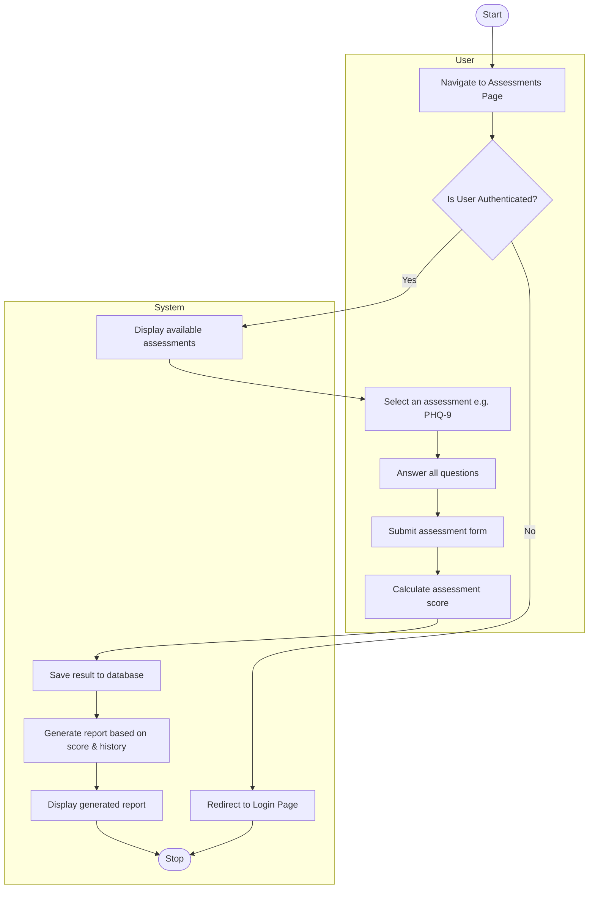

```mermaid
flowchart TD
    A0([Start]) --> U1

    %% User Partition
    subgraph User
        U1[Navigate to Assessments Page] --> S1
    end

    %% System Partition
    subgraph System
        S1{Is User Authenticated?}
    end

    S1 -->|Yes| S2
    S1 -->|No| S3

    subgraph System
        S2[Display available assessments]
        S3[Redirect to Login Page]
    end

    S3 --> A1([Stop])
    S2 --> U2

    %% User actions
    subgraph User
        U2["Select an assessment e.g. PHQ-9"] --> U3
        U3[Answer all questions] --> U4
        U4[Submit assessment form] --> S4
    end

    %% System processing
    subgraph System
        S4[Calculate assessment score] --> S5
        S5[Save result to database] --> S6
        S6[Generate report based on score & history] --> S7
        S7[Display generated report] --> A1([Stop])
    end

```
