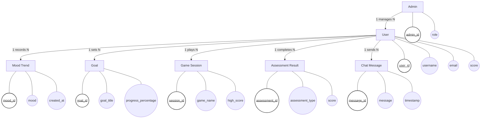

```mermaid
graph TD
    %% Style for Primary Keys (underlined)
    classDef pk fill:#fff,stroke:#333,stroke-width:2px,text-decoration:underline;

    %% Entities
    User[User]
    Admin[Admin]
    MoodTrend[Mood Trend]
    Goal[Goal]
    GameSession[Game Session]
    Assessment[Assessment Result]
    ChatMessage[Chat Message]

    %% --- USER ---
    userId((user_id)):::pk
    username((username))
    email((email))
    score((score))

    User --- userId
    User --- username
    User --- email
    User --- score

    %% --- ADMIN ---
    adminId((admin_id)):::pk
    adminRole((role))

    Admin --- adminId
    Admin --- adminRole

    %% --- MOOD TREND ---
    moodId((mood_id)):::pk
    mood((mood))
    mood_createdAt((created_at))

    MoodTrend --- moodId
    MoodTrend --- mood
    MoodTrend --- mood_createdAt

    %% --- GOAL ---
    goalId((goal_id)):::pk
    goalTitle((goal_title))
    goalProgress((progress_percentage))

    Goal --- goalId
    Goal --- goalTitle
    Goal --- goalProgress

    %% --- GAME SESSION ---
    gameSessionId((session_id)):::pk
    gameName((game_name))
    gameScore((high_score))

    GameSession --- gameSessionId
    GameSession --- gameName
    GameSession --- gameScore

    %% --- ASSESSMENT ---
    assessmentId((assessment_id)):::pk
    assessmentType((assessment_type))
    assessmentScore((score))

    Assessment --- assessmentId
    Assessment --- assessmentType
    Assessment --- assessmentScore

    %% --- CHAT MESSAGE ---
    messageId((message_id)):::pk
    message((message))
    messageTimestamp((timestamp))

    ChatMessage --- messageId
    ChatMessage --- message
    ChatMessage --- messageTimestamp


    %% --- Relationships (NO DIAMONDS) ---
    Admin -- "1 manages N" --> User

    User -- "1 records N" --> MoodTrend

    User -- "1 sets N" --> Goal

    User -- "1 plays N" --> GameSession

    User -- "1 completes N" --> Assessment

    User -- "1 sends N" --> ChatMessage
```