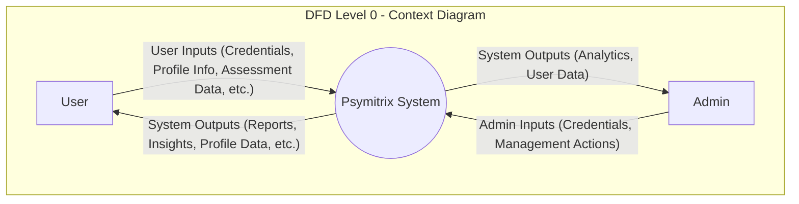

```mermaid
graph TD
    subgraph DFD Level 0 - Context Diagram
        A[User]
        B[Admin]
        C((Psymitrix System))

        A -- User Inputs (Credentials, Profile Info, Assessment Data, etc.) --> C
        C -- System Outputs (Reports, Insights, Profile Data, etc.) --> A
        B -- Admin Inputs (Credentials, Management Actions) --> C
        C -- System Outputs (Analytics, User Data) --> B
    end
```
