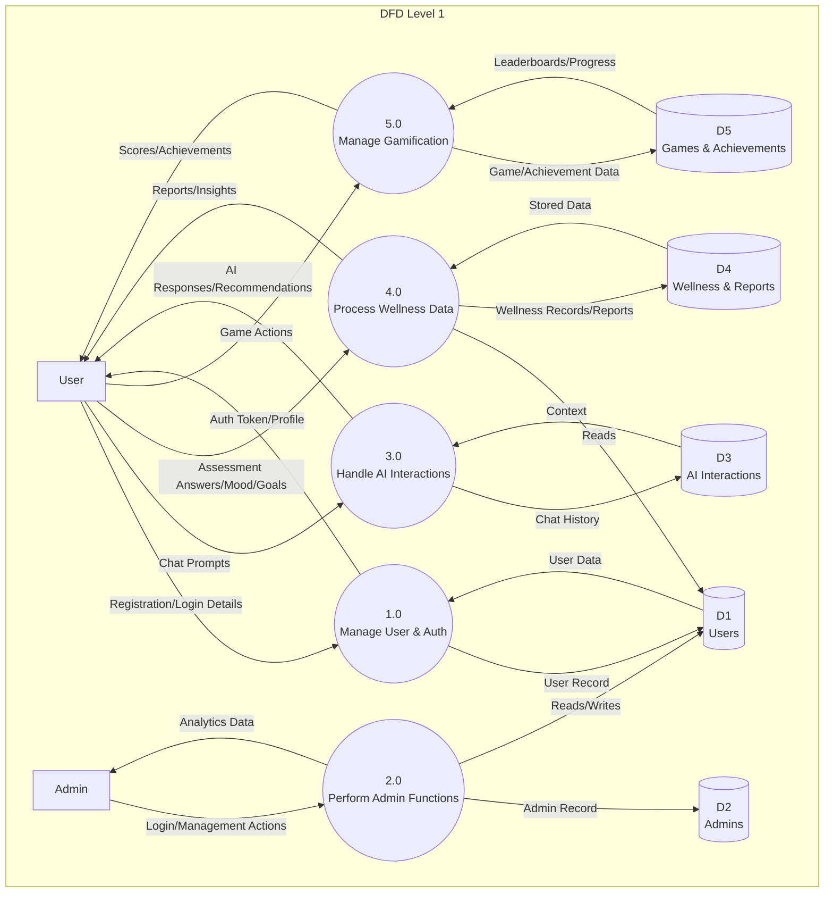

```mermaid
graph TD
    subgraph DFD Level 1
        %% External Entities
        User
        Admin

        %% Processes
        P1(("1.0<br>Manage User & Auth"))
        P2(("2.0<br>Perform Admin Functions"))
        P3(("3.0<br>Handle AI Interactions"))
        P4(("4.0<br>Process Wellness Data"))
        P5(("5.0<br>Manage Gamification"))

        %% Data Stores
        DS_Users[("D1<br>Users")]
        DS_Admins[("D2<br>Admins")]
        DS_Interactions[("D3<br>AI Interactions")]
        DS_Wellness[("D4<br>Wellness & Reports")]
        DS_Games[("D5<br>Games & Achievements")]

        %% Flows
        User -- Registration/Login Details --> P1
        P1 -- User Record --> DS_Users
        DS_Users -- User Data --> P1
        P1 -- Auth Token/Profile --> User

        Admin -- Login/Management Actions --> P2
        P2 -- Admin Record --> DS_Admins
        P2 -- Reads/Writes --> DS_Users
        P2 -- Analytics Data --> Admin

        User -- Chat Prompts --> P3
        P3 -- Chat History --> DS_Interactions
        DS_Interactions -- Context --> P3
        P3 -- AI Responses/Recommendations --> User

        User -- Assessment Answers/Mood/Goals --> P4
        P4 -- Reads --> DS_Users
        P4 -- Wellness Records/Reports --> DS_Wellness
        DS_Wellness -- Stored Data --> P4
        P4 -- Reports/Insights --> User

        User -- Game Actions --> P5
        P5 -- Game/Achievement Data --> DS_Games
        DS_Games -- Leaderboards/Progress --> P5
        P5 -- Scores/Achievements --> User
    end
```
