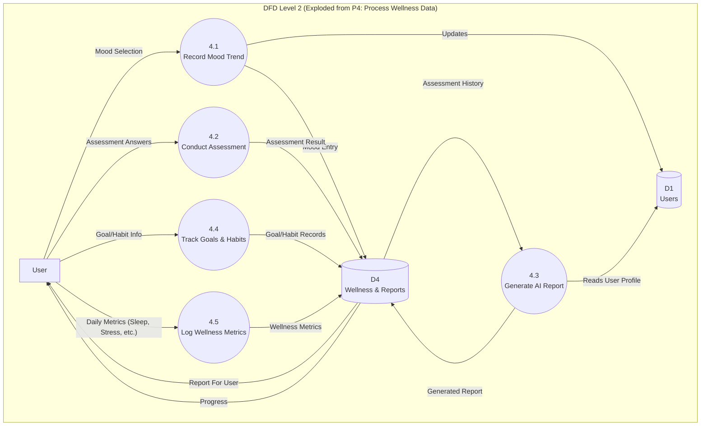

```mermaid
graph TD
    subgraph "DFD Level 2 (Exploded from P4: Process Wellness Data)"
        %% External Entities
        User

        %% Processes
        P4_1(("4.1<br>Record Mood Trend"))
        P4_2(("4.2<br>Conduct Assessment"))
        P4_3(("4.3<br>Generate AI Report"))
        P4_4(("4.4<br>Track Goals & Habits"))
        P4_5(("4.5<br>Log Wellness Metrics"))

        %% Data Stores
        DS_Users[("D1<br>Users")]
        DS_Wellness[("D4<br>Wellness & Reports")]

        %% Flows
        User -- Mood Selection --> P4_1
        P4_1 -- Mood Entry --> DS_Wellness
        P4_1 -- Updates --> DS_Users

        User -- Assessment Answers --> P4_2
        P4_2 -- Assessment Result --> DS_Wellness
        DS_Wellness -- Assessment History --> P4_3

        P4_3 -- Reads User Profile --> DS_Users
        P4_3 -- Generated Report --> DS_Wellness
        DS_Wellness -- Report For User --> User

        User -- Goal/Habit Info --> P4_4
        P4_4 -- Goal/Habit Records --> DS_Wellness
        DS_Wellness -- Progress --> User

        User -- Daily Metrics (Sleep, Stress, etc.) --> P4_5
        P4_5 -- Wellness Metrics --> DS_Wellness
    end
```
