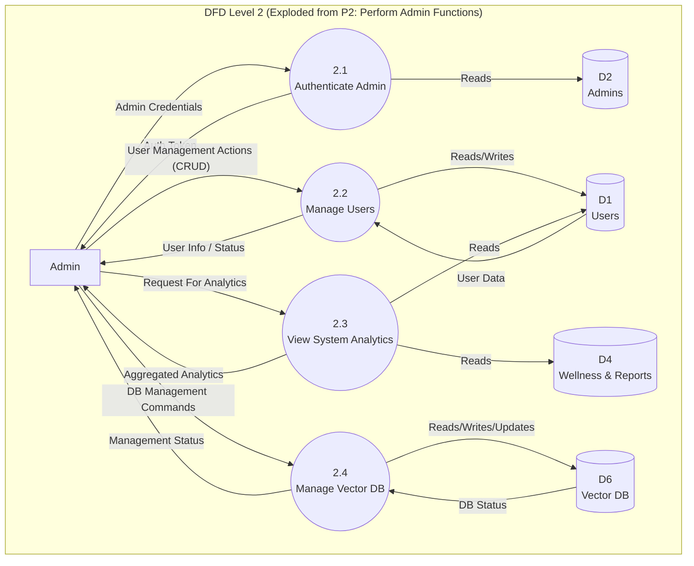

```mermaid
graph TD
    subgraph "DFD Level 2 (Exploded from P2: Perform Admin Functions)"
        %% External Entities
        Admin

        %% Processes
        P2_1(("2.1<br>Authenticate Admin"))
        P2_2(("2.2<br>Manage Users"))
        P2_3(("2.3<br>View System Analytics"))
        P2_4(("2.4<br>Manage Vector DB"))

        %% Data Stores
        DS_Admins[("D2<br>Admins")]
        DS_Users[("D1<br>Users")]
        DS_Wellness[("D4<br>Wellness & Reports")]
        DS_VectorDB[("D6<br>Vector DB")]

        %% Flows
        Admin -- Admin Credentials --> P2_1
        P2_1 -- Reads --> DS_Admins
        P2_1 -- Auth Token --> Admin

        Admin -- User Management Actions (CRUD) --> P2_2
        P2_2 -- Reads/Writes --> DS_Users
        DS_Users -- User Data --> P2_2
        P2_2 -- User Info / Status --> Admin

        Admin -- Request For Analytics --> P2_3
        P2_3 -- Reads --> DS_Users
        P2_3 -- Reads --> DS_Wellness
        P2_3 -- Aggregated Analytics --> Admin

        Admin -- DB Management Commands --> P2_4
        P2_4 -- Reads/Writes/Updates --> DS_VectorDB
        DS_VectorDB -- DB Status --> P2_4
        P2_4 -- Management Status --> Admin
    end
```
