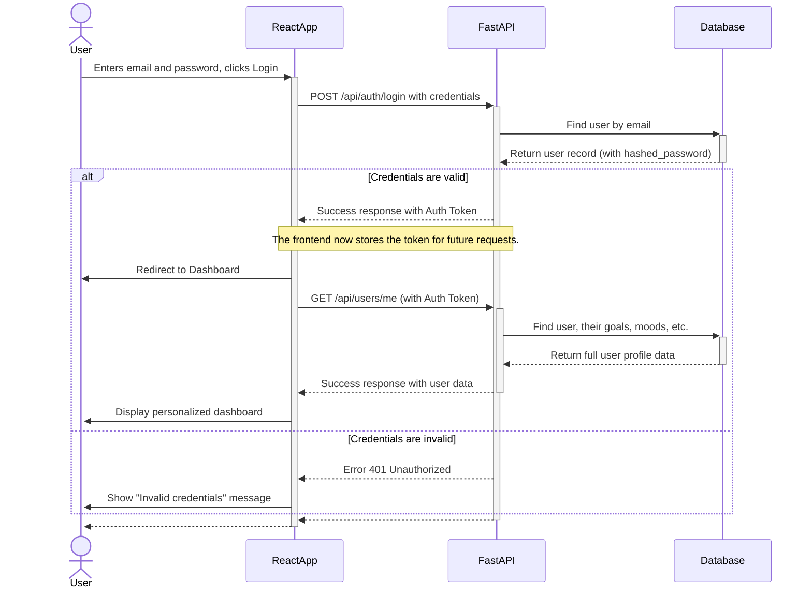

```mermaid
sequenceDiagram
    actor User
    participant Frontend as ReactApp
    participant Backend as FastAPI
    participant Database

    User->>+Frontend: Enters email and password, clicks Login
    Frontend->>+Backend: POST /api/auth/login with credentials
    
    Backend->>+Database: Find user by email
    Database-->>-Backend: Return user record (with hashed_password)
    
    alt Credentials are valid
        Backend-->>Frontend: Success response with Auth Token
        
        Note over Frontend,Backend: The frontend now stores the token for future requests.

        Frontend->>User: Redirect to Dashboard

        %% Second flow: Fetching user data after login
        Frontend->>+Backend: GET /api/users/me (with Auth Token)
        Backend->>+Database: Find user, their goals, moods, etc.
        Database-->>-Backend: Return full user profile data
        Backend-->>-Frontend: Success response with user data
        
        Frontend->>+User: Display personalized dashboard

    else Credentials are invalid
        Backend-->>Frontend: Error 401 Unauthorized
        Frontend->>User: Show "Invalid credentials" message
    end

    %% Deactivate participants from the first flow
    Backend-->>-Frontend: 
    Frontend-->>-User: 
```