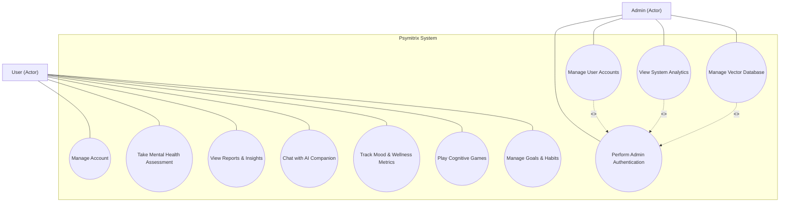

```mermaid
graph TD
    %% Define Actors
    UserActor["User (Actor)"]
    AdminActor["Admin (Actor)"]

    %% Define System Boundary
    subgraph Psymitrix System
        direction LR
        %% Core User Use Cases (Ovals)
        UC1(("Manage Account"))
        UC2(("Take Mental Health Assessment"))
        UC3(("View Reports & Insights"))
        UC4(("Chat with AI Companion"))
        UC5(("Track Mood & Wellness Metrics"))
        UC6(("Play Cognitive Games"))
        UC7(("Manage Goals & Habits"))
        
        %% Core Admin Use Cases (Ovals)
        UC8(("Manage User Accounts"))
        UC9(("View System Analytics"))
        UC10(("Manage Vector Database"))
        UC11(("Perform Admin Authentication"))
    end

    %% Actor Associations
    UserActor --- UC1
    UserActor --- UC2
    UserActor --- UC3
    UserActor --- UC4
    UserActor --- UC5
    UserActor --- UC6
    UserActor --- UC7

    AdminActor --- UC8
    AdminActor --- UC9
    AdminActor --- UC10
    AdminActor --- UC11
    
    %% Use Case Relationships (Dotted line for <<include>>)
    UC8 -.->|"<<include>>"| UC11
    UC9 -.->|"<<include>>"| UC11
    UC10 -.->|"<<include>>"| UC11
```